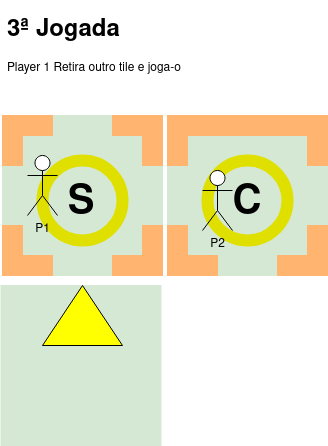

# Mecânica Básica do Jogo

## Componentes do Jogo:

- **Tiles:** Peças quadradas que compõem o caminho seguido pelos jogadores.
- **Marcadores das Personagens:** Representam as personagens jogáveis e suas localizações no tabuleiro.
- **Dados:** Utilizados para determinar a ordem de jogada e resultados em certas situações.

### Tiles
Os tiles são o coração do jogo, formando o caminho que os jogadores percorrem. Cada tile possui dois lados: frente e trás. Na frente, há portas ou muros em suas arestas e uma indicação do tipo de tile no centro. Na parte de trás, há uma seta que deve ser alinhada com uma porta de um tile virado para cima.

**Tipos de Tiles**:

- **Inicio:** Representa o ponto de partida do jogo e apresenta portas nas quatro arestas.
- **Caminho:** Serve como passagem, contendo de uma a quatro portas.
- **Desafio:** Quando virado, o jogador enfrentará um desafio específico, também com de 1 a 4 portas.
- **Bónus:** Quando virado, o jogador pode retirar uma carta de bónus e contém de 1 a 4 portas.
Sequência de Jogo:
## Fases principais

**Determinar Ordem Inicial:** Os jogadores lançam um dado e o jogador com o menor lançamento começa o jogo.\
**Começo do Jogo:** O jogador inicial retira um tile e coloca-o de forma a conectar com uma das portas do tile "Inicio" no tabuleiro. O jogador seguinte, por sua vez, pode tirar um tile do monte ou optar por virar o tile colocado pelo jogador anterior.\
**Construção do Caminho:** Os jogadores alternam entre colocar tiles no tabuleiro, garantindo que as portas se conectem de forma coerente. Cada novo tile deve ser alinhado com as portas existentes.\
**Enfrentar Desafios e Bónus:** Quando um jogador coloca um tile "Desafio", ele enfrenta um desafio específico. Caso um tile "Bónus" seja colocado, o jogador pode retirar uma carta de bónus.\
**Movimentação das Personagens:** Os jogadores movem os seus marcadores de personagem de acordo com os tiles que colocaram. A movimentação depende do número de portas disponíveis em cada tile.
Objetivo do Jogo:

O objetivo do jogo é avançar pelo caminho, enfrentando desafios, tirando partido dos bónus e construindo uma narrativa inclusiva. Os jogadores trabalham em conjunto para criar um caminho contínuo e resolver desafios, aprendendo a superar obstáculos como uma equipa. A vitória é alcançada quando todos preconceitos/desafios forem eliminados. O jogo acaba se um das personagens for eliminada.

## Personagens
Cada personagem tem um conjunto de prós e contras baseada na sua incapacidade. Todas as personagens tem 15 pontos de vida. Sempre que um desafio não é superado os jogadores envolvidos lançam um dado e perdem os pontos de vida que sai nos dados.

## Exemplo basico de jogo
\
\
\
\
\
