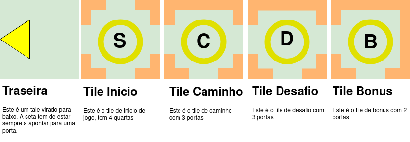
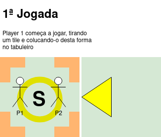
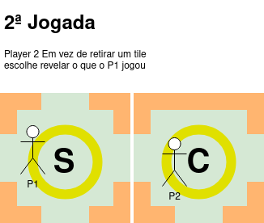
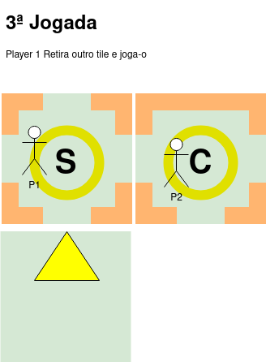
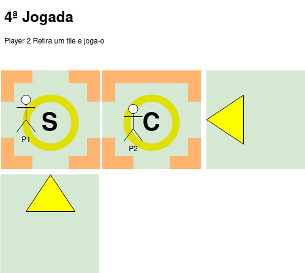
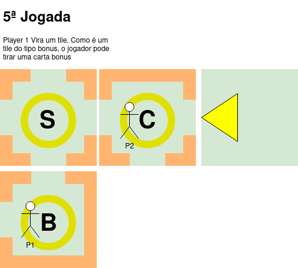
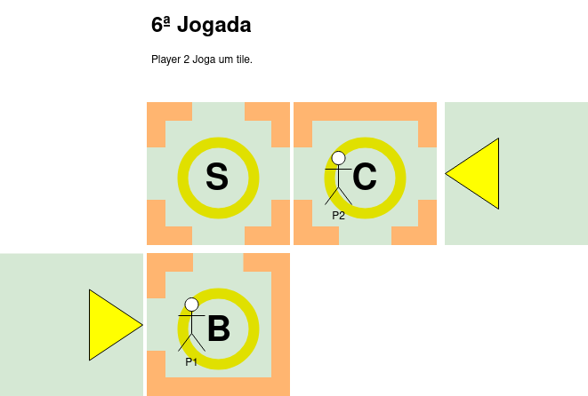
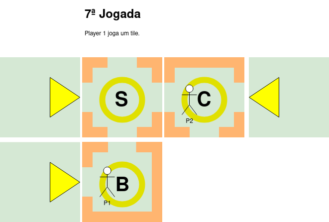
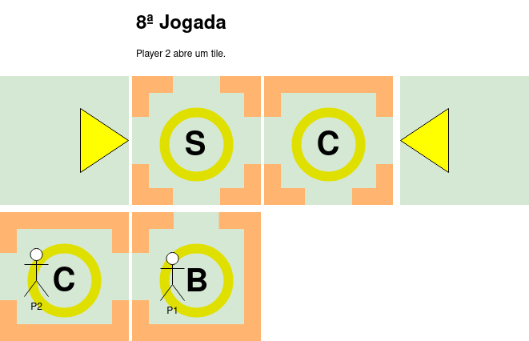

# Journey to Inclusion

**Título do Jogo:** "Caminhos da Inclusão: A Jornada dos Preconceitos"

**Descrição do Jogo:**

"Caminhos da Inclusão: A Jornada dos Preconceitos" é um jogo de tabuleiro inovador e emocionante que mergulha os jogadores numa jornada de conscientização, empatia e superação. Inspirado nas experiências reais de pessoas com deficiência de diferentes partes do mundo, o jogo oferece uma perspectiva única sobre os desafios que enfrentam no dia a dia.

Os jogadores assumem o papel de uma das seis personagens inspiradoras - Kazi, Li Wei, Sofia, Aiden, Leila e Alex - cada uma representando uma deficiência específica. O objetivo do jogo é avançar pelo tabuleiro, enfrentar obstáculos baseados em preconceitos e superá-los através de estratégia, trabalho em equipe e empatia.

**Principais Características:**

- **Jogabilidade Colaborativa:** O jogo promove a colaboração entre os jogadores, refletindo a importância da união na luta contra os preconceitos. Os jogadores devem trabalhar juntos para superar obstáculos e avançar na jornada.

- **Histórias Inspiradoras:** Cada personagem tem a sua própria história inspiradora, refletindo experiências reais de superação. Os jogadores aprendem sobre as lutas, vitórias e determinação das personagens enquanto jogam.

- **Diversidade de Desafios:** O jogo apresenta uma variedade de desafios que refletem preconceitos e obstáculos enfrentados por pessoas com deficiência. Desde barreiras de acessibilidade até estereótipos arraigados, os jogadores são desafiados a pensar de maneira criativa para superar cada obstáculo.

- **Mecânicas Inovadoras:** O jogo incorpora mecânicas que simulam as limitações e habilidades das personagens. Por exemplo, o jogador que representa Alex, com deficiência de mobilidade, pode enfrentar desafios específicos relacionados ao movimento no tabuleiro.

- **Conscientização e Empatia:** Além de entretenimento, o jogo tem como objetivo educar os jogadores sobre as lutas das pessoas com deficiência e promover a empatia. Cada partida é uma oportunidade para os jogadores entenderem melhor as experiências dos outros.

# Personagens

## Personagem com Deficiência Física 
**Nome:** Kazi\
**Continente:** África\
**História:** Kazi é um carpinteiro talentoso que enfrentou um acidente na infância que resultou na amputação de uma das suas pernas. Utilizou a sua habilidade com a madeira para construir próteses personalizadas para si e para outros membros da comunidade com deficiência física. Kazi é um símbolo de força e perseverança, inspirando os outros a superar desafios físicos e a abraçar as suas capacidades.

## Personagem com Deficiência Visual
**Nome:** Li Wei \
**Continente:** Ásia\
**História:** Li Wei é um músico talentoso que perdeu a visão num acidente. É professor de música, ensinando jovens e adultos com deficiência visual a tocar vários instrumentos. A sua paixão pela música e dedicação à educação demonstram a importância da acessibilidade e inclusão em todas as formas de arte.

## Personagem com Deficiência Auditiva:
**Nome:** Sofia\
**Continente:** América do Sul\
**História:** Sofia é uma linguista apaixonada que nasceu surda. Defensora da língua gestual, trabalha para promover a sua aceitação e ensino em escolas e comunidades. Além disso, apoia eventos culturais inclusivos, mostrando que a comunicação não verbal é uma forma poderosa de expressão.

## Personagem com Deficiência Cognitiva:
**Nome:** Aiden \
**Continente:** Europa\
História: Aiden é um investigador científico dedicado que vive com uma deficiência cognitiva. A sua perspetiva única levou a abordagens inovadoras na resolução de problemas. É exemplo de como diferentes modos de pensar podem enriquecer a sociedade. Aiden orienta jovens que enfrentam desafios semelhantes, inspirando-os a confiar nas suas habilidades e a explorar novos horizontes.

## Personagem com Deficiência Mental:
**Nome:** Leila\
**Continente:** Oceania\
**História:** Leila é uma assistente social dedicada que lida com uma deficiência mental. Trabalha incansavelmente para aumentar a consciencialização sobre questões de saúde mental e promover a importância do apoio emocional e social. Leila é uma voz poderosa para aqueles que enfrentam desafios de saúde mental, demonstrando que é possível viver uma vida plena e significativa com o devido apoio e compreensão.

## Personagem com Deficiência de Mobilidade:
**Nome:** Alex\
**Continente:** América do Norte\
**História:** Alex é um(a) jovem de espírito aventureiro, nascido(a) com uma deficiência de mobilidade devido a uma condição neuromuscular. Apesar de usar uma cadeira de rodas para se deslocar, a sua determinação e energia são contagiantes. Desde tenra idade, Alex desenvolveu um amor pelas montanhas e pela natureza circundante da sua terra natal. Com uma mentalidade engenhosa, transformou a sua cadeira de rodas numa cadeira off-road, que lhe permite explorar trilhos de montanha e terrenos acidentados.

# Inimigos

**Preconceito:** Desafio da Percepção Limitada\
**Inimigo:** Valentina, a Cética\
**Características:** Valentina é uma pessoa cética que constantemente subestima as habilidades das personagens devido às suas deficiências. Ela duvida da capacidade das personagens de contribuir para a missão e tenta desencorajá-las. Valentina age com um tom condescendente e está sempre pronta para apontar falhas.

**Preconceito:** Barreiras de Acessibilidade\
**Inimigo:** Arnold, o Arquiteto Insensível\
**Características:** Arnold é um arquiteto insensível que desenha edifícios sem considerar a acessibilidade. Ele não se preocupa com rampas para cadeiras de rodas, elevadores ou sinais táteis. Arnold defende suas decisões com justificativas superficiais e se recusa a reconhecer a importância da acessibilidade.

**Preconceito:** Estereótipos Enraizados\
**Inimigo:** Estela, a Estereotipadora\
**Características:** Estela é uma pessoa que perpetua estereótipos em relação às deficiências das personagens. Ela age de forma condescendente, referindo-se a eles em termos limitativos. Estela representa a mentalidade que minimiza as realizações das personagens, baseando-se em preconceitos.

**Preconceito:** Exclusão Social\
**Inimigo:** Ronaldo, o Exclusivista\
Características: Ronaldo é um organizador de eventos sociais que exclui intencionalmente as personagens com deficiência. Ele nega convites para eventos, restringe oportunidades e discrimina com base nas deficiências. Ronaldo se esforça para manter seu círculo social restrito.

**Preconceito:** Falta de Representação\
**Inimigo:** Jude, a Ignorante Midiática\
**Características:** Jude é uma personalidade midiática ignorante que perpetua a falta de representação das pessoas com deficiência. Ela faz comentários insensíveis em programas de mídia e redes sociais, contribuindo para a desinformação e reforçando estereótipos.

**Preconceito:** Dificuldades no Local de Trabalho\
**Inimigo:** Alan, o Ignorante do Escritório\
**Características:** Alan é um colega de trabalho ignorante que não compreende as necessidades das personagens. Ele faz piadas insensíveis e não se preocupa com a acessibilidade do local de trabalho. Alan cria um ambiente de trabalho hostil e desafiador.

**Preconceito:** Bullying e Discriminação\
**Inimigo:** Bianca, a Bully\
**Características:** Bianca é uma pessoa que pratica bullying e discriminação ativamente contra as personagens. Ela zomba das deficiências, faz comentários humilhantes e tenta isolar as personagens. Bianca age de maneira cruel e insensível.

**Preconceito:** Dificuldades nas Viagens\
**Inimigo:** Thomas, o Inflexível do Transporte\
**Características:** Thomas é um funcionário de transporte público que não considera as necessidades das pessoas com deficiência. Ele se recusa a fornecer assistência, ignora solicitações especiais e cria obstáculos desnecessários para as personagens ao viajar.

**Preconceito:** Luta por Direitos e Inclusão\
**Inimigo:** Jessica, a Burocrata Resistente\
**Características:** Jessica é uma burocrata resistente que trava uma batalha contra as ações das personagens em busca de melhorias de acessibilidade. Ela cria obstáculos burocráticos, desacelera os processos e resiste a mudanças significativas.

**Preconceito:** Falta de Conhecimento\
**Inimigo:** Eduardo, o Desinformado\
**Características:** Eduardo é uma pessoa desinformada que não entende as deficiências das personagens. Ele faz comentários inadvertidamente insensíveis, baseados em equívocos sobre as deficiências. Eduardo representa a necessidade de educação constante sobre o assunto.
# Historia
Num mundo diverso, onde pessoas de todos os cantos vivem suas vidas, cinco destinos se entrelaçam de maneira inesperada. Kazi, Li Wei, Sofia, Aiden, Leila e Alex, aparentemente desconhecidos entre si, partilham uma característica que transcende suas origens: cada um deles enfrenta preconceitos e obstáculos diários devido às suas deficiências.

Nas vastas planícies da África, Kazi trabalha incansavelmente em sua oficina, onde cria próteses para os necessitados. No outro lado do mundo, em uma remota aldeia asiática, Li Wei compartilha sua paixão pela música com crianças com deficiência visual, mostrando-lhes que o mundo das melodias é acessível a todos.

Enquanto isso, na América do Sul, Sofia defende a linguagem gestual mágicos, organizando workshops que conectam pessoas surdas e ouvintes numa expressão artística única. Na Europa, Aiden desafia as barreiras acadêmicas, contribuindo para a ciência de formas que sua deficiência cognitiva jamais impediu. Na Oceania, Leila trabalha para criar uma rede de apoio para aqueles que enfrentam batalhas silenciosas contra a saúde mental. E na America, Alex, uma jovem aventureira, apesar de usar uma cadeira de rodas, Alex transformou-a numa cadeira off-road para explorar trilhos de montanha e terrenos acidentados. A energia e determinação de Alex destacam-se, assim como a sua dedicação em promover a acessibilidade em espaços naturais.

Um encontro casual durante uma conferência global de inclusão acende a chama do destino. Compartilhando suas histórias e desafios, eles percebem que, apesar das diferenças culturais e geográficas, têm muito em comum. Cada um deles carrega uma determinação feroz de superar as limitações impostas pelos preconceitos da sociedade.

Decidem unir forças para enfrentar os preconceitos que todos eles conhecem muito bem. O objetivo é claro: criar uma mudança real no mundo, mostrando que as deficiências não definem uma pessoa e que todos têm um papel fundamental a desempenhar na sociedade.

Os cinco heróis estabecem os alicerces da sua missão. Compartilham conhecimento, experiência e, acima de tudo, uma visão comum de um mundo mais inclusivo. A jornada que se avizinha não será fácil, mas estão determinados a enfrentar os obstáculos e desafios com coragem e empatia.

A busca pela derrota dos preconceitos começa agora, enquanto o grupo se prepara para embarcar numa jornada que testará suas forças, desafiará as normas sociais e inspirará mudanças que ecoarão através das gerações. Unidos por um objetivo comum, Kazi, Li Wei, Sofia, Aiden, Leila e Alex estão prontos para transformar o mundo, um passo de cada vez.

## Preconceitos/Desafios
- **Desafio da Percepção Limitada:** Enquanto viajam juntos, o grupo encontra pessoas que subestimam suas habilidades devido às suas deficiências. São desafiados a superar as expectativas e a demonstrar as suas capacidades únicas.

- **Barreiras de Acessibilidade:** Ao tentar chegar a locais importantes para a sua missão, as personagens enfrentam problemas de acessibilidade, como edifícios sem rampas para cadeiras de rodas ou ausência de intérpretes de linguagem gestual.

- **Estereótipos Enraizados:** Cada personagem lida com estereótipos baseados em suas deficiências. Por exemplo, Aiden pode ser subestimado devido à sua deficiência cognitiva, e Leila pode encontrar pessoas que minimizam a sua experiência de saúde mental.

- **Exclusão Social:** Em algumas situações, podem ser excluídos de eventos sociais ou oportunidades com base nas suas deficiências. Isso leva o grupo a defender a importância da inclusão e a sensibilizar os outros.

- **Falta de Representação:** Eles notam a ausência de representação das pessoas com deficiência nos meios de comunicação e na cultura popular, o que leva a mal-entendidos e estereótipos.

- **Dificuldades no Local de Trabalho:** Conforme trabalham juntos para promover a inclusão, as personagens enfrentam desafios no local de trabalho, como ambientes não adaptados ou falta de compreensão por parte dos colegas.

- **Bullying e Discriminação:** Em alguns lugares, o grupo pode encontrar situações de bullying e discriminação, o que os leva a fortalecer ainda mais os laços uns com os outros e a se defenderem.

- **Dificuldades nas Viagens:** Durante a sua jornada, as personagens podem encontrar dificuldades em viagens, como transporte público inadequado para pessoas com deficiência ou alojamentos não adaptados.

- **Luta por Direitos e Inclusão:** À medida que o grupo se torna mais proeminente em suas ações, eles podem enfrentar resistência e burocracia quando tentam implementar mudanças significativas, como melhorias na acessibilidade em espaços públicos.

- **Falta de Conhecimento:** A ignorância sobre as deficiências das personagens pode levar a mal-entendidos e comportamentos insensíveis por parte de outras pessoas, exigindo uma educação constante.
# Mecânica Básica do Jogo

## Componentes do Jogo:

- **Tiles:** Peças quadradas que compõem o caminho seguido pelos jogadores.
- **Marcadores das Personagens:** Representam as personagens jogáveis e suas localizações no tabuleiro.
- **Dados:** Utilizados para determinar a ordem de jogada e resultados em certas situações.

### Tiles
Os tiles são o coração do jogo, formando o caminho que os jogadores percorrem. Cada tile possui dois lados: frente e trás. Na frente, há portas ou muros em suas arestas e uma indicação do tipo de tile no centro. Na parte de trás, há uma seta que deve ser alinhada com uma porta de um tile virado para cima.

**Tipos de Tiles**:

- **Inicio:** Representa o ponto de partida do jogo e apresenta portas nas quatro arestas.
- **Caminho:** Serve como passagem, contendo de uma a quatro portas.
- **Desafio:** Quando virado, o jogador enfrentará um desafio específico, também com de 1 a 4 portas.
- **Bónus:** Quando virado, o jogador pode retirar uma carta de bónus e contém de 1 a 4 portas.

Os tiles estao todos num monte, virados para baixo e aleatoriamente distruibuidos, com exceção do tile "Inicio", que é colocado no centro do tabuleiro. Os tiles são retirados do monte e colocados no tabuleiro, de forma a conectar as portas de forma coerente. Cada novo tile deve ser alinhado com as portas existentes.

## Sequência de Jogo

- **Determinar Ordem Inicial:** Os jogadores lançam um dado e o jogador com o menor lançamento começa o jogo.
- **Começo do Jogo:** O jogador inicial retira um tile e coloca-o de forma a conectar com uma das portas do tile "Inicio" no tabuleiro. O jogador seguinte, por sua vez, pode tirar um tile do monte ou optar por virar o tile colocado pelo jogador anterior.
- **Construção do Caminho:** Os jogadores alternam entre colocar tiles no tabuleiro, garantindo que as portas se conectem de forma coerente. Cada novo tile deve ser alinhado com as portas existentes.
- **Enfrentar Desafios e Bónus:** Quando um jogador coloca um tile "Desafio", ele enfrenta um desafio específico. Caso um tile "Bónus" seja colocado, o jogador pode retirar uma carta de bónus.
- **Movimentação das Personagens:** Os jogadores movem os seus marcadores de personagem de acordo com os tiles que colocaram. A movimentação depende do número de portas disponíveis em cada tile, sendo que cada personagem apenas se pode mover 3 tiles por jogada.

## Objetivo do Jogo:
O objetivo do jogo é avançar pelo caminho, enfrentando desafios, tirando partido dos bónus e construindo uma narrativa inclusiva. Os jogadores trabalham em conjunto para criar um caminho contínuo e resolver desafios, aprendendo a superar obstáculos como uma equipa. A vitória é alcançada quando todos preconceitos/desafios forem eliminados. O jogo acaba se um das personagens for eliminada.

## Personagens
Cada personagem tem um conjunto de prós e contras baseada na sua incapacidade. Todas as personagens tem 15 pontos de vida. Sempre que um desafio não é superado os jogadores envolvidos lançam um dado e perdem os pontos de vida que sai nos dados.

## Exemplo basico de jogo
\
\
\
\

## Habilidades Das Personagens

### Aiden (Deficiência Cognitiva)
- **Vantagens:**
    - Não perde pontos de vida quando enfrenta um desafio. 
- **Desvantagens:**
    - Perde 3 pontos de vida sempre que outra personagem perder um desafio

### Li Wei (Deficiência Visual)
- **Vantagens:**
    - não pode escolher sua localização no mapa de tiles, os outros jogadores escolheram por ele, refletindo sua limitação de percepção. 
- **Desvantagens:**
    - Ela tem a habilidade especial de "Tocar e Conhecer". Quando ela joga um tile, ela pode virar dois tiles do monte e escolher qual deles jogar virado para cima. Isso representa sua capacidade de usar o tato para tomar decisões informadas.

### Sofia (Deficiência Auditiva)
- **Vantagens:**
    - Sofia não pode comunicar diretamente com os outros jogadores durante o jogo, representando a sua surdez.
- **Desvantagens:** 
    - Ela tem a habilidade especial "Linguagem Gestual". Quando coloca um tile "Caminho", Sofia pode escolher revelar um tile adicional do monte e mostrá-lo aos outros jogadores, comunicando informações sem usar palavras.

### Kazi (Deficiência Física)
- **Vantagens:**
    - Devido à sua deficiência física, Kazi tem um alcance limitado ao colocar tiles. Ele só pode colocar tiles que estejam a até duas casas de distância da sua posição atual. 
- **Desvantagens:**
    - No entanto, Kazi possui a habilidade única "Construtor Adaptado". Quando coloca um tile "Desafio", ele pode adicionar um marcador "Ponte" no tile, permitindo que os jogadores evitem o desafio ao passar por ele.

### Alex (Deficiência de Mobilidade)
- **Vantagens:**
    - Alex pode mover-se apenas 2 casas de cada vez no tabuleiro, representando a limitação de sua mobilidade. 
- **Desvantagens:**
    - Ela possui a habilidade única de "Exploração Adaptada". Alex pode escolher parar em uma casa desafio sem ter que enfrentá-lo imediatamente, permitindo-lhe avaliar a situação antes de prosseguir.

### Leila (Doença Mental)
- **Vantagens:**
    - Leila é um suporte emocional para a equipa. Ela tem a habilidade especial "Apoio Empático". Sempre que um jogador perder pontos de vida após um desafio, Leila pode oferecer palavras de encorajamento, permitindo que o jogador perca 1 ponto de vida a menos do que o resultado do dado.
    
- **Desvantagens:**
    - No entanto, Leila tem a habilidade especial "Sobrecarga Emocional". Sempre que um jogador perder um desafio, Leila perde 1 ponto de vida adicional, representando o impacto emocional que a situação tem sobre ela.
    - Leila não pode enfrentar desafios, representando a sua doença mental.

## Inimigos Mecanica e habilidades

### Personagens

O jogo tem 2 lotes de cartas, o lote das pequenas com as cartas com pontuação de 2 a 5 e o lote das grandes com as cartas de 6 a 10.
Sempre que uma personagem vai jogar contra um inimigo ela tem uma mecânica baseada na sua deficiência para sacar e jogar as cartas.\
Para eleminar cada inimigo a soma das cartas jogadas, cada jogador apenas pode jogar combinações de 3 cartas, tem de ser igual ou superior ao número de pontos de vida do inimigo.

**A personagem invisual:** pode ir buscar as 5 cartas ao baralho das grandes, mais 4 extra do baralho de cartas pequenas, Mas ela não pode ver as cartas que joga, ou seja tem de baralhar as 9 cartas e escolher 4 com a face voltada para baixo.\

**A personagem com deficiência auditiva:** pode ir buscar as 5 cartas ao lote das grandes mas terá de dizer aos outros jogadores que cartas vai jogar através de mímica, sendo que se os jogadores disserem uma carta errada, caso a personagem tenha essa carta é obrigada a jogada essa carta, se não tiver podem tentar outra vez, caso falhem vão buscar a primeira carta do baralho das pequenas e jogam essa carta.

**Personagem com deficiência cognitiva** esta personagem vai buscar 5 cartas ao baralho das grandes e escolhe 4 cartas para jogar mas por cada carta jogada lança um dado numerado de 1 a 4, o resultado do lançamento do dado vai ser descontado no valor da carta.

**Personagem com deficiência física:** esta personagem vai buscar 3 cartas ao baralho das pequenas e 2 aos das grandes e acrescenta 2 contos a cada uma das 3 cartas que vai jogar.

**Personagem com deficiência mental:** esta personagem vai buscar 5 cartas ao baralho das pequenas, refletindo a sua falta de confiança.
Mas caso tenho um jogador a jogar o mesmo desafio soma 4 pontos a duas das três cartas que vai jogar.

**Personagem com Deficiência de Mobilidade:** pode escolher 3 cartas do lote das pequenas e 2 cartas do lote das grandes. Além disso, Alex pode escolher um jogador para "empurrar" sua cadeira de rodas virtualmente no tabuleiro, o que concede um bônus de 2 pontos extras a cada uma das 3 cartas jogadas contra o inimigo.

### Inimigos

**Desafio da Percepção Limitada - Valentina, a Cética**\
Valentina pode diminuir temporariamente o valor das cartas jogadas pelas personagens. Por exemplo, quando as personagens jogam cartas contra Valentina, o valor total das cartas pode ser reduzido em 1 ou 2 pontos, representando a dúvida e subestimação que ela lança sobre as personagens.

**Barreiras de Acessibilidade - Arnold, o Arquiteto Insensível**\
Arnold pode adicionar "barreiras" ao campo de jogo, reduzindo temporariamente o valor das cartas jogadas. Para superar essas barreiras, as personagens precisam jogar cartas extras ou fazer um esforço adicional para compensar a falta de acessibilidade.

**Estereótipos Enraizados - Estela, a Estereotipadora**\
Quando as personagens jogam cartas contra Estela, ela pode influenciar negativamente a escolha das cartas. Por exemplo, ela pode escolher aleatoriamente uma das cartas jogadas e reduzir seu valor pela metade, representando o impacto dos estereótipos nas ações das personagens.

**Exclusão Social - Ronaldo, o Exclusivista**\
Ronaldo pode "excluir" uma das personagens do jogo por um turno, representando a discriminação. A personagem excluída não pode jogar cartas contra o inimigo, mas ainda pode jogar cartas para ajudar os outros jogadores.

**Falta de Representação - Jude, a Ignorante Midiática**\
Jude pode influenciar negativamente a eficácia das cartas jogadas pelas personagens. Ela pode escolher uma carta jogada e reduzir seu valor em uma quantidade fixa, simbolizando a desinformação que ela dissemina. Por exemplo, ela pode reduzir o valor de uma carta em 2 pontos, representando a falta de representação das pessoas com deficiência na mídia.
 
**Dificuldades no Local de Trabalho - Alan, o Ignorante do Escritório**\
Alan pode adicionar "obstáculos" que as personagens devem superar para jogar suas cartas. Isso pode envolver jogar cartas extras ou perder pontos de vida adicionais, refletindo o ambiente hostil criado por ele. Por exemplo, ele pode adicionar um obstáculo que exige que as personagens joguem uma carta extra para superá-lo, ou ele pode adicionar um obstáculo que faz com que as personagens percam 1 ponto de vida adicional, representando o impacto emocional de suas ações.

**Bullying e Discriminação - Bianca, a Bully**\
Bianca pode escolher uma das personagens e reduzir temporariamente o valor da soma das cartas jogadas por essa personagem. Isso representa o impacto emocional do bullying e da discriminação. Para isso é lancado um lado de 4 faces e o resultado é o número de pontos que a personagem vai perder.

**Dificuldades nas Viagens - Thomas, o Inflexível do Transporte**\
Thomas pode bloquear ações das personagens, forçando-as a "esperar" por um turno, representando obstáculos no transporte. As personagens "perdem" um turno ao enfrentar Thomas. Nessa estera a personagem perde 3 pontos de vida.

**Luta por Direitos e Inclusão - Jessica, a Burocrata Resistente**\
Jessica obriga a personagem a tirar 6 cartas do baralho das grandes mas o jogador apenas pode jogar 2 cartas.

**Falta de Conhecimento - Eduardo, o Desinformado**\
Quando as personagens jogam cartas contra Eduardo, ele pode escolher uma carta jogada e adicionar um valor aleatório, representando a influência de comentários insensíveis baseados na falta de conhecimento.
